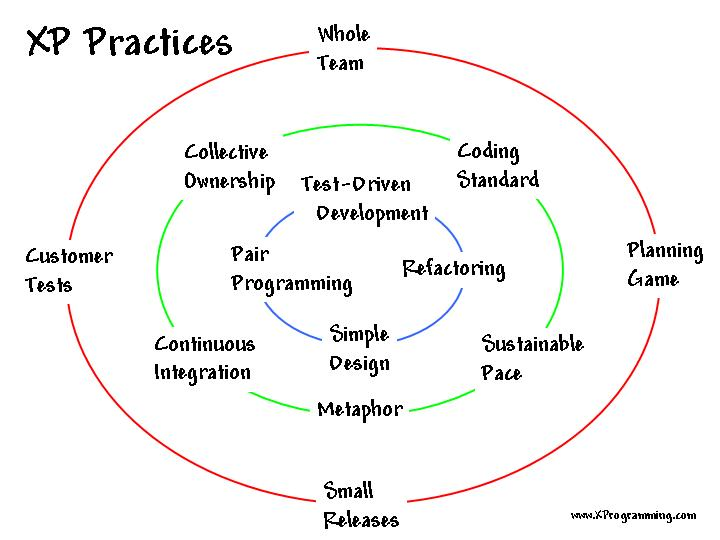

# <소프트웨어 장인> 산드로 만쿠소

> 내겐 없는 여유, 다른 누군가에겐 있는 여유, 136쪽

...
기능이 추가될 때마다 시스템이 더 커지고 테스트 시간은 늘어나고 QA 주기는 더욱 늦어진다.
개발자들은 항상 코드를 더한다.
이렇게 더해진 코드들은 작업한 개발자 당사자는 물론 주변 개발자들에게도 디버깅거리를 늘린다.
주변 개발자들은 그 코드의 버그 때문에 자신의 모듈에서 문제가 발생하면
해당 코드가 어떤 영향을 미쳤는지 분석하고 이해해야 한다.
결과적으로 팀 전체적으로 디버깅 시간을 늘리는 것이다.
이렇게 낭비되는 모든 시간들을 생각해보자.
매일, 매주, 매달, 매년.
이 모든 시간 낭비가 개발자들이 단위 테스트를 작성할 '시간이 없기(!!)' 때문에 발생한다.
...

> 단위 테스트 작성은 별개의 업무인가, 137쪽

- 단위 테스트는 우리가 코드를 작성하는 방식에 이미 녹아있는 것이지 별도의 작업이 아니다.
  - 기능 구현 완료에는 단위 테스트의 구현 및 테스트 완료까지 포함되어야 한다.
- 공식적인 작업 일정표에 무언가를 올려 놓는다는 것은 Product Owner가 그중 중요하지 않다고 생각하는 것을 삭제할 수 있는 권리를 준다는 것과 같다.

> 실행 관례와 가치, 153쪽

...
기술적 실행 관례들 그 자체를 직접적으로 팔려고 드는 것은 아무런 의미가 없다.
그렇게 해서는 상대방을 납득시킬 수 없다.
**실행 관례의 도입 자체를 관리자나 팀 구성원들에게 설득하려 하지 말고
현재 일하는 방식과 비교해서 그것이 가져올 이익에 집중을 해야 한다.**
빠른 피드백 루프, 요구사항과 비용에 대한 더 나은 이해, 지식 공유, 줄어드는 버그,
전체적으로 자동화되고 릴리즈가 빨라지는 일들이 기술적 실행 관례를 도입함으로써
얻을 수 있는 가치들이다.

_출처: [xprogramming.com](https://www.xprogramming.com/what-is-extreme-programming)_

> 테스트 먼저, 155쪽

- 아이디어를 생각해내는 데도 도움이 되고 한 번에 하나씩만 집중할 수 있다.
- 모듈, 클래스, 함수를 구체적으로 정의하도록 강제하여 일을 점진적으로 진행할 수 있다.
- 코드 작성 완료 후 실제 환경에서 기대한 대로 동작할 것이라고 강하게 확신할 수 있다.
- 테스트 코드가 준비되어 있으면 각 테스트 작업들은 몇 msec(단위 테스트)에서
  몇 초(상위 수준 테스트)정도 소요되어 피드백 루프가 상당히 빨라진다.
- 테스트 코드는 잘 정리된 요구사항의 역할도 하기 때문에 딱 필요한 만큼만 코딩하도록 유도하여
  불필요하게 복잡해지거나 오버 엔지니어링을 하는 것을 줄여준다.
- 이러한 것들이 바로 비즈니스적인 가치다.

> 테스트 주도 개발, 156쪽

- 가장 흔한 오해가 TDD를 단위 테스트와 동일하게 생각하는 것이다. TDD는 테스트 단위가 어느 정도로 작아야 하는지 강제하지 않는다.
- TDD의 이름 자체에 '테스트'가 들어 있기는 하지만 사실 **TDD는 설계에 대한 실행 관례다.**
- 테스트가 코딩 방향을 주도하면 복잡한 코드를 작성하는 것 자체가 어려워진다.
  - 요구사항만큼만 만족시키는, 즉 테스트로 규정된 부분만 작성하게 되기 때문이다.
  - 코드가 복잡하고 방대하면 테스트 자체가 어렵기 때문이다.

> 실용주의, 162쪽

- 언제든지 TDD보다 더 나은 가치와 더 빠른 피드백 루프를 줄 수 있는 다른 것이 있다면 그것을 TDD 대신 도입해야 한다.
- 항상 우리가 무엇을 하고 있고 그것을 왜 하고 있는지 질문해야 한다.
- 특정 실행 관례가 더 이상 우리에게 가치를 주지 못한다면 그 실행 관례를 버려야 한다.
- 소프트웨어 장인으로서, 우리의 일에 항상 최선의 기술, 도구, 절차, 방법론 그리고 실행 관례를 선택할 수 있도록 개방적인 사고 방식을 가져야 한다.

> 잘못된 방향으로 동기 부여하기, 243쪽

- 잘못된 테스트는 아예 테스트가 없는 것보다 못하다.
